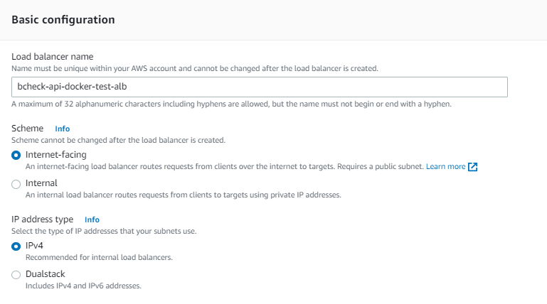
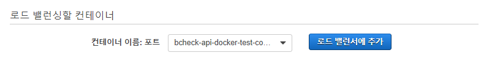

### Project Build   
- gradle를 통해서 build/bootJar를 실행시켜 Jar를 생성한다.   
- bootJar를 통해서 생성된 jar 파일을 확인한다.
  build/libs/bcheck-api-0.0.1-SNAPSHOT.jar   
- jar 실행  (실행하지 말자)
  java -Dspring.profiles.active=local -jar bcheck-api-docker-test-0.0.1-SNAPSHOT.jar   

### Docker Build   
```text
FROM centos:7
RUN yum -y update &&  yum -y install initscripts && yum -y install git && yum -y install java-11-openjdk && yum -y install wget && yum -y install telnet && yum -y install net-tools && yum clean all && yum clean metadata && rm -rf /var/cache/yum/*
VOLUME /tmp
ARG JAR_FILE
WORKDIR /
COPY ${JAR_FILE} bcheck-api-docker-test.jar
COPY entrypoint.sh entrypoint.sh
RUN chmod 755 /entrypoint.sh
RUN mkdir /logs
RUN touch /logs/bcheck-app.log
WORKDIR /
EXPOSE 7777/tcp
ENTRYPOINT ["sh", "entrypoint.sh"]
```   
- docker build 명령 실행  
  현재 나의 로컬 도커의 이미지 상태 확인   
```shell
histui-MacBookPro:bcheck-api-docker-test hist$ docker images
REPOSITORY   TAG       IMAGE ID   CREATED   SIZE
```
  도커 빌드 실행
```shell 
histui-MacBookPro:bcheck-api-docker-test hist$ docker build -t bcheck-api-docker-test --build-arg JAR_FILE=build/libs/bcheck-api-docker-test-0.0.1-SNAPSHOT.jar .
[+] Building 21.0s (5/11)                                                                                                                                                                                        
 => => resolve docker.io/library/centos:7@sha256:0f4ec88e21daf75124b8a9e5ca03c37a5e937e0e108a255d890492430789b60e                                                                                           0.0s
 => => sha256:0f4ec88e21daf75124b8a9e5ca03c37a5e937e0e108a255d890492430789b60e 1.20kB / 1.20kB                                                                                                              0.0s
 => => sha256:e4ca2ed0202e76be184e75fb26
```
  빌드로 생성된 이미지 확인   
```shell
histui-MacBookPro:bcheck-api-docker-test hist$ docker images
REPOSITORY               TAG       IMAGE ID       CREATED              SIZE
bcheck-api-docker-test   latest    a29ccdc29b21   About a minute ago   670MB
histui-MacBookPro:bcheck-api-docker-test hist$ 
```   
  빌드된 이미지를 컨테이너로 실행시키기  
```shell
histui-MacBookPro:bcheck-api-docker-test hist$ docker run -p 7777:7777 bcheck-api-docker-test
```
  브라우저에서 확인하기 : http://localhost:7777/app/swagger-ui.html   
  도커 컨테이너 확인하기 (다른 커맨드창을 열어서 확인한다)
```shell
histui-MacBookPro:bcheck-api-docker-test hist$ docker container ps
CONTAINER ID   IMAGE                    COMMAND              CREATED          STATUS          PORTS                                       NAMES
81fe3bb6b34c   bcheck-api-docker-test   "sh entrypoint.sh"   34 seconds ago   Up 33 seconds   0.0.0.0:7777->7777/tcp, :::7777->7777/tcp   sharp_nightingale
histui-MacBookPro:bcheck-api-docker-test hist$   
```
  리소스 정리 순서 - 도커 컨테이너 Stop -> 도커 컨테이너 삭제 -> 도커 이미지 삭제   
```shell
histui-MacBookPro:bcheck-api-docker-test hist$ docker stop 81fe3bb6b34c
histui-MacBookPro:bcheck-api-docker-test hist$ docker rm a2c15feb2caf
a2c15feb2caf
histui-MacBookPro:bcheck-api-docker-test hist$ docker rmi bcheck-api-docker-test
Untagged: bcheck-api-docker-test:latest
Deleted: sha256:a29ccdc29b21359642a8a626c924514aace3ca2467a2edf95bdf6329e533c84a
histui-MacBookPro:bcheck-api-docker-test hist$ docker images
REPOSITORY   TAG       IMAGE ID   CREATED   SIZE
histui-MacBookPro:bcheck-api-docker-test hist$ 
```

### AWS CodeCommit 리포지토리 생성   
- 리포지토리명 : bcheck-api-docker-test   
### AWS CodeCommit 리포지토리에 소스 올리기   
- command 명령어를 통한 git 올리기
```shell
$ git init
$ git add *
$ git commit -m "Init"
```
- git remote 확인
```shell
$ git remote -v
```
- git remote add
CodeCommit에서 생성된 URL을 등록한다.   
```shell
$ git remote add origin https://git-codecommit.ap-northeast-2.amazonaws.com/v1/repos/bcheck-api-docker-test
$ git remote -v
origin  https://git-codecommit.ap-northeast-2.amazonaws.com/v1/repos/bcheck-api-docker-test (fetch)
origin  https://git-codecommit.ap-northeast-2.amazonaws.com/v1/repos/bcheck-api-docker-test (push)
```
- remote에 Push하기 
```shell
$ git push origin master
```
자기 IAM 계정에서 발급한 CodeCommit에 대한 ID와 Password를 입력해서 원격에 Push (아이디와 패스워드를 묻는다면)  

### ECR 레포지토리 생성 
- Private
- Repository Name : bcheck-api-docker-test-repo

### CodeBuild를 사용해서 빌드 및 배포 하기 (ECR 배포)
- CodeBuild Console에서 프로젝트 생성 
  프로젝트 이름 : bcheck-api-docker-test-codebuild  
  소스 공급자 : AWS CodeCommit   
  레포지토리 : bcheck-api-docker-test   
  참조유형 : 브렌치   
  브렌치 : master
  소스버전 확인 : refs/heads/master   
  환경 : 관리형이미지   
  운영체제 : Amazon Linux2   
  런타임 : Standard   
  이미지 : aws/codebuild/amazonlinux2-x86_64-standard:3.0   
  이미지 버전 : 이 런타임 버전에 항샹 최신 이미지 사용  
  환경 유형 : Linux
  권한이 있음 : 체크  
  서비스 역할 : 새 서비스 역할   
  역할 이름 : codebuild-bcheck-api-docker-test-codebuild-service-role 
  빌드 사양 : buildspec 파일 사용   
  Buildspec 이름 - 선택 사항 : buildspec.yaml
- buildspec.yaml 작성 
```yaml
 version: 0.2

 env:
   variables:
     SPRING_PROFILE: "dev"

 phases:
   install:
     runtime-versions:
       docker: 18
     commands:
   pre_build:
     commands:
       - echo Logging in to Amazon ECR...
       - aws --version
       - aws ecr get-login-password --region ap-northeast-2 | docker login --username AWS --password-stdin 160270626841.dkr.ecr.ap-northeast-2.amazonaws.com
       - REPOSITORY_URI=160270626841.dkr.ecr.ap-northeast-2.amazonaws.com/bcheck-api-docker-test-repo
       - COMMIT_HASH=$(echo $CODEBUILD_RESOLVED_SOURCE_VERSION | cut -c 1-7)
       - IMAGE_TAG=${COMMIT_HASH:=latest}
   build:
     commands:
       - chmod +x ./gradlew
       - echo unit testing ...
       - SPRING_PROFILES_ACTIVE=${SPRING_PROFILE} ./gradlew test
       - echo make jar ...
       - ./gradlew assemble
       - echo Build started on `date`
       - echo Building the Docker image...
       - docker build -f Dockerfile -t $REPOSITORY_URI:latest --build-arg JAR_FILE=build/libs/bcheck-api-docker-test-0.0.1-SNAPSHOT.jar .
       - docker tag $REPOSITORY_URI:latest $REPOSITORY_URI:$IMAGE_TAG
       - echo Build completed on `date`
       - echo Pushing the Docker images...
       - docker push $REPOSITORY_URI:latest
       - docker push $REPOSITORY_URI:$IMAGE_TAG
   post_build:
     commands:
       - DATE=`date`
       - echo Build completed on $DATE
 cache:
   paths:
     - '/root/.gradle/**/*'
```
- 빌드 실행전에 codebuild가 ECR 사용에 대한 권한 부여   
  AWS Console에서 bcheck-api-docker-test-codebuild 프로젝트에서 편집 > 환경 선택   
  환경 편집에서 서비스 역할명 복사 후 다른 브라우저창에서 AWS Console에 들어가 IAM으로 이동함.   
  서비스 역할명 : codebuild-bcheck-api-docker-test-codebuild-service-role   
  IAM > 역할 > 검색 => codebuild-bcheck-api-docker-test-codebuild-service-role   
  해당 역할을 클릭 > 요약 화면에서 [인라인 정책 추가]    
  서비스 선택 : Elastic Container Registry   
  작업 : 수동작업 > 모든 Elastic Container Registry 작업(ecr.*) 체크  
  리소스 클릭 > 특정 > 이 게정의 모든 항목 체크   
  [정책 검토] 클릭 > 이름에 bcheck-api-docker-test-codebuild-ecr-role 입력 > [정책 생성] 버튼 클릭   

- CodeBuild에서 프로젝트를 빌드 한다.  
  빌드 로그를 확인해 본다.  
  빌드가 완료되었으면 ECR 레포지토리에 가서 이미지가 생성되었는지 확인한다.   

### CodeCommit에 코드가 Push되는 이벤트가 발생되었을 때 자동으로 CodeBuild 실행
- Lambda 함수 생성 
  함수 이름 : bcheck-api-docker-test-cicd-func   
  런타임 : Python 3.9   
  기본 실행 역할 변경 : 기존 Lambda 권한을 가진 새 역할 생성   
  [함수 생성] 버튼 클릭  
- Lambda 트리거 생성
  생성된 람다의 함수 개요 아래 [+트리거 추가] 버튼을 클릭한다.  
  o 트리거 구성 : CodeCommit   
  o 리포지토리 이름 : bcheck-api-docker-test   
  o 트리거 이름 : bcheck-api-docker-test-cicd-func   
  o 이벤트 : 모든 리포지토리 이벤트   
  o 브렌치 이름 : 모든 브렌치   
  [추가] 버튼을 클릭한다.  
  생성된 트리거가 람다 함수와 연결된 것을 확인할 수 있다.   
- 소스 입력   
```text
import json
import boto3

codecommit = boto3.client('codecommit')

def lambda_handler(event, context):
    print(event['Records'])
    #branch 이름 셋팅
    dev_trigger_branch = 'refs/heads/dev'   ## dev version 
    master_trigger_branch = 'refs/heads/master'  ## master version

    #Log the updated references from the event
    references = { reference['ref'] for reference in event['Records'][0]['codecommit']['references'] }
    print("References: "  + str(references))
    print("Trigger branch: "  + master_trigger_branch)

    #branch 이름 문자열로 비교, 동시에 두개 이상의 branch 가 push 되는 경우 references 
    if str(references).find(str(master_trigger_branch)) >= 0 :
        cb = boto3.client('codebuild')

        #Get the repository from the event and show its git clone URL
        repository = event['Records'][0]['eventSourceARN'].split(':')[5]
        try:
            print('Starting build for codebulid {0}'.format('bcheck-api-docker-test-codebuild'))
            build = {
               'projectName': 'bcheck-api-docker-test-codebuild', # event['Records'][0]['customData'],
               'sourceVersion': event['Records'][0]['codecommit']['references'][0]['commit']
            }
            print('source version => {0}'.format(event['Records'][0]['codecommit']['references'][0]['commit']))
            response = cb.start_build(**build);
            print('Successfully launched a CodeBuild build!')
        except Exception as e:
            print(e)
            print('Error getting repository {}. Make sure it exists and that your repository is in the same region as this function.'.format(repository))
            raise e     
    else :
        print("References: "  + str(references) + " is not trigger branch")
``` 
- [Deploy] 버튼을 클릭해서 람다함수에 적용한다.   
- 람다 함수가 codebuild의 실행 권한을 위한 권한 부여   
  람다 함수 화면에서 [구성] 탭을 클릭한다.   
  [구성] 탭 화면에서 좌측의 [권한] 메뉴를 클릭한다.   
  샐행 역할에서 역할 이름으로 명시된 Role을 클릭한다. (IAM의 Role로 넘어갈 것이다)   
  [인라인 정책 추가]를 클릭한다.   
  서비스 선택에서 CodeBuild를 선택한다.  
  엑세스 레벨에서 쓰기 > StartBuild 를 체크  
  리소스에서 특정 > 이 계정의 모든 항목 체크   
  [정책 검토] 버튼을 클릭
  이름 : bcheck-api-docker-test-lambda-role
  [정책 생성] 버튼을 클릭해서 정책을 생성한다.   
- 람다 함수 실행을 위해서 로컬에서 코드를 수정하고 Commit/Push 수행   
  README.md 파일을 열고 하단 아래 아무거나 작성하기..   
  command창에서 프로젝트로 폴더내에서 commit/push 수행  
  ```shell
  $ git add *
  $ git commit -m "update"
  $ git push origin master
  ```
- AWS CodeBuild에서 해당 프로젝트의 CodeBuild가 진행되고 있는지 확인한다.
- ECR 레포지토리에서 이미지를 확인한다.
- 람다 함수에서 로그를 확인한다.   


### ECS Cluster 생성 및 설정   
- ECS Cluster 생성
  클러스터 템플릿 선택 : 네트워킹 전용 (AWS Fargate)   
  
  클러스터 이름 : bcheck-api-docker-test-cluster   
  네트워깅
  
  - VPC 생성 : 해당 클러스터에 새 VPC 생성 체크
  - CIDR 블록 : 10.0.0.0/16
  - 서브넷 1 : 10.0.0.0/24
  - 서브넷 2 : 10.0.1.0/24
    CloudWatch 컨테이너 인사이트
  - CloudWatch 컨테이너 인사이트 활성화 체크   
  - [생성하기] 버튼 클릭
     - VPC 생성 확인 (ex: vpc-081cc724c8b75e299)
     - 서브넷 1, 2 생성 확인
     - VPC 가용 영역 확인
     - 인터넷 게이트웨이, 라우팅 테이블 생성 확인
     - VPC 게이트웨이 생성 확인
     - 서브넷 라우팅 테이블 생성 확인
     
- Target Group 생성
  - 타켓 타입 : IP addresses
  - 타겟 그룹명 : bcheck-api-docker-test-tg
  - Protocol: HTTP
  - Port : 7777
  - VPC : vpc-081cc724c8b75e299 (클러스터 생성시 생성한 VPC 선택)
  - Protocol Version : HTTP1
  - Health checks
    - Health check protocol : HTTP
    - Health check path : /app/swagger-ui.html
    - Success codes : 302  (Redirect)
  - Register targets
    - Network: 디폴트 선택
    - Ports: 7777
  - [Create target group] 버튼 클릭
- Load Balancer 생성
  - EC2 Console에서 로드 밸런싱 생성 
    - Load Balancer 유형 선택 : Application Load Balancer
    - Basic configuration
      
      - Load balancer name : bcheck-api-docker-test-alb
      - Scheme : Internet-facing
      - IP address type : IPv4
    - Network mapping
      
      - VPC : 클러스터 생성시 생성한 VPC 선택
      - Mappings : ap-northeast-2a, ap-northeast-2b check
    - Security groups : default 생성
    - Listeners and routing
      
      - Protocol : HTTP
      - Port : 80
      - Default action : bcheck-api-docker-test-tg (생성한 타겟그룹 선택)
    - [Create load balancer] 클릭
      
    - DNS 이름 확인
      
- ECS 작업 정의 생성
  - 시작 유형 호환성 선택 : FARGATE  선택 Click   
    
  - 작업 및 컨테이너 정의 구성   
    - 테스트 정의 이름 : bcheck-api-docker-test-task
    - 호환성 요구 사항 : FARGATE
    - 테스트 역할 : 디폴트
    - 네트워크 모드 : awsvcp
      
  - 작업 실행 IAM 역할
    - 작업 실행 역할 : ecsTaskExecutionRole  (역할이 없으면 자동 생성됨)
      
  - 작업 크기
    - 작업 메모리 => 2G  
    - 작업 CPU > CPU => 1vCPU
      
  - 컨테이너 정의
    - 컨테이너 추가 버튼 클릭
      - 컨테이너 이름 : bcheck-api-docker-test-container  
      - 이미지 : 160270626841.dkr.ecr.ap-northeast-2.amazonaws.com/bcheck-api-docker-test-repo:latest
      - 메모리 제한 : 소프트제한 2048
      - 포트매핑 : 7777
        
  - [생성] 버튼 클릭
- ECS 서비스 생성
  - 서비스 구성
    - 시작 유형 : FARGATE
    - 작업 정의 : bcheck-api-docker-test-task, 개정 : 3(latest) 
    - 플랫폼 버전 : LATEST
    - 클러스터 : bcheck-api-docker-test-cluster
    - 서비스 이름 : bcheck-api-docker-test-ecs-service
    - 서비스 유형 : REPLICA
    - 작업 개수 : 3
    - 최소 정상 상태 백분율 : 100
    - 최대 백분율 : 200
    - 배포 회로 차단기 : 비활성화됨
      
  - 배포 
    - 배포 유형 : 롤링 업데이트
  - 작업 태그 지정 구성 
    - ECS 관리형 태그 활성화 check
    - 태그 전파 시작 : 전파하지 않음
  - 다음 단계 클릭 
  - 네트워크 구성 
    - VPC 및 보안 그룹
      - 클러스터 VPC : 10.0.0.0/16 (이전 클러스터 생성시 생성한 VPC)
      - 서브넷 : Public Subnet 2개 선택해서 추가
      - 보안그룹 : 자동생성됨 (bcheck-7144) => port 추가 : 7777
      - 자동 할당 퍼블릭 IP : EANBLED
        
  - 로드 밸런싱 
    - 로드 밸런서 유형 : Application Load Balancer   
    - 로드 밸런서 이름 : bcheck-api-docker-test-alb (이전에 생성한것 선택)
      
  - 로드 밸런싱할 컨테이너
       
    [로드 밸런서에 추가] 버튼 클릭   
       - 프로덕션 리스터 포트 : 80:HTTP
       - 프로덕션 리스터 프로토콜 : HTTP
       - 대상 그룹 이름 : bcheck-api-docker-test-tg (이전 생성한 타켓그룹)
       - 대상 그룹 프로토콜 : HTTP
       - 대상 유형 : ip
       - 경로 패턴 : /
       - 상태 확인 경로 : /
  - 서비스 생성 확인  
    
- ALB의 DNS명 확인 후 테스트
  http://bcheck-api-docker-test-alb-738414931.ap-northeast-2.elb.amazonaws.com/app/swagger-ui.html   
  http://bcech-api-docker-test-ecs-alb-1585387887.ap-northeast-2.elb.amazonaws.com/app/api/book/isbn?isbn=0060930314